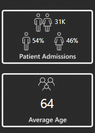
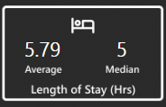
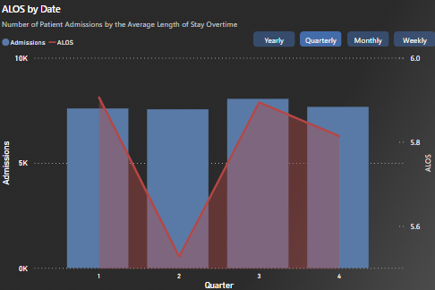
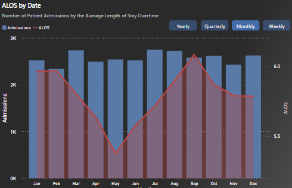
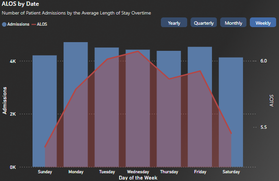
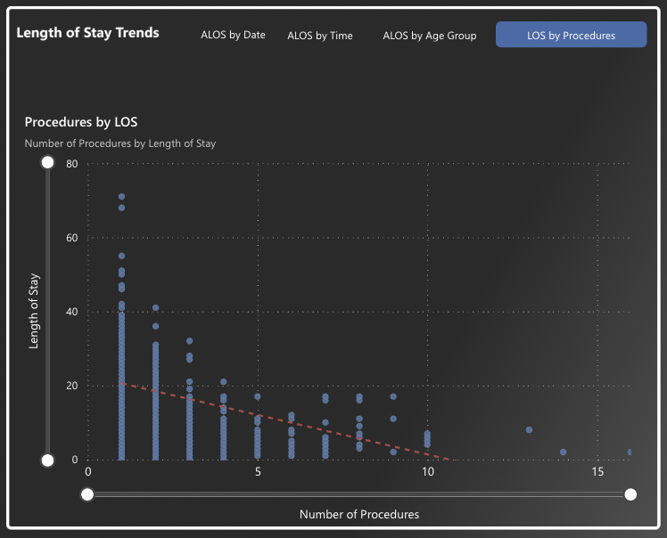
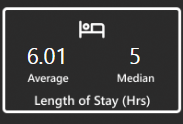
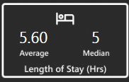
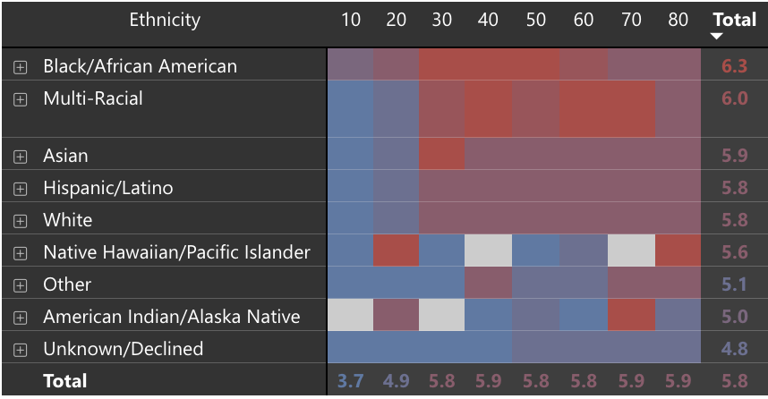
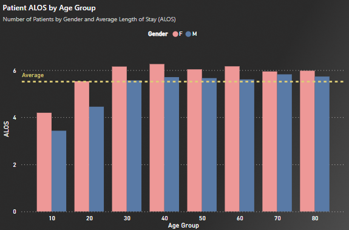

# Emergency Department Length of Stay Analysis


## **Project Summary**

In this project, I developed an interactive Power BI dashboard to analyze and identify operational potential inefficiencies. The dashboard focuses on **Average Length of Stay (ALOS)**—a critical healthcare quality indicator recognized by CMS. Reducing LOS helps improve patient outcomes, lower costs, and increase hospital throughput.

Using real emergency department data from Beth Israel Deaconess Medical Center's **MIMIC-III deidentified clinical data set** accessed via Google Cloud, the dashboard reveals **time-based trends, demographic disparities, and factors influencing LOS** over a **10-year period (2001 to 2012)**.

---

## **Objectives**

- Develop an interactive Power BI dashboard to monitor and explore **Average Length of Stay (ALOS)** as a key healthcare quality indicator.
- Analyze key factors associated with an increased Average Length of Stay (ALOS) in the emergency department.
- Determine peak hours and days of high patient volume to uncover operational bottlenecks.
- Examine gender-based differences in emergency department ALOS.
- Investigate disparities in ALOS across different ethnic groups.
- Assess how ALOS varies across patient age groups to identify trends by life stage.

---

## Summary Insights

- The **average LOS** (ALOS) is **5.79 hours**; the **median** is **5 hours**.
- LOS tends to **spike during afternoon shifts**, with peaks around **12–1 PM**.
- **Wednesday** and **September** show notably higher ALOS compared to other days/months.
- A **moderate negative correlation** was found between the number of procedures and LOS.
- **Black/African American patients** and **women** experienced significantly longer stays.
- Statistical tests confirmed **disparities by race and gender**.

---

## Data Description

- **Source**: PhysioNet’s MIMIC-III dataset
    - Tables used:
        - [Admissions](https://mimic.mit.edu/docs/iii/tables/admissions/)
        - [Patients](https://mimic.mit.edu/docs/iii/tables/patients/)
        - [d_icd_diagnoses](https://mimic.mit.edu/docs/iii/tables/d_icd_diagnoses/)
        - [d_icd_procedures](https://mimic.mit.edu/docs/iii/tables/d_icd_procedures/)
        - [diagnosis_icd](https://mimic.mit.edu/docs/iii/tables/diagnoses_icd/)
        - [procedures_icd](https://mimic.mit.edu/docs/iii/tables/procedures_icd/)
- **Accessed through**: Google Cloud BigQuery
- The dataset includes over **50,000+ ED visits** with patient demographic, procedural, and timestamp data spanning a 10-year period.

---

## Data Cleaning & Preprocessing

- Queried and cleaned the data using **SQL and Power BI**, addressing:
    - Created LOS variable by subtracting  Discharge date and Registration date
    - Removed Invalid entries (e.g., negative length of stay)
    - Combined Admission table with Patients table containing demographic information
    - Grouped Sub-Ethnic groups into larger ethnic groups to create broader trends
    - Created age group bins
- Filtered key variables for analysis:
    - LOS
    - Time of admission
    - Diagnostic procedures
    - Demographics (age, sex, race/ethnicity)

---

## Exploratory Data Analysis (EDA)

### 🏥 Population Characteristics

- **Total Patients**: 31,000
- **Gender Distribution**: 54% Male, 46% Female
- **Average Age**: 64 years – suggesting elderly patients are the most frequent visitors



---

### ⚙️ Performance & Efficiency

### 1. **When is the ED busiest?**

- **Afternoon Shift (12 PM – 4 PM)** is the busiest with the highest patient volume.
- ALOS is also longer during this time—suggesting a strain on resources.


### 2. **What are the overall LOS metrics?**

- **ALOS**: 5.79 hours
- **Median LOS**: 5 hours
- **Outliers** significantly affect ALOS.



### 3. **Does LOS vary by time?**

Q1 & Q3 show higher ALOS, possibly due to seasonal illnesses.




 September has the highest ALOS (6.08 hours).




Wednesday has the longest average LOS.



### 4. Impact of the number of Procedures on LOS

- It seems that as the number of procedures increase, patient length of stay decreases.
- This finding is surprising because one would think that more procedures would increase a patients stay. However, it could be the case that effective procedures help to pinpoint issues faster and lead to more efficient treatment, minimizing patient stay.



### 👥 Demographic Insights

### 1. **Gender Differences in LOS**

- **Women** had a higher ALOS (6.01 hours) compared to **men** (5.64 hours).
- Median LOS remained constant—pointing to greater outlier influences among female patients.

ALOS for Women



ALOS for men



### 2.  Racial/Ethnic Differences in LOS

- **Black/African American** patients had the **highest ALOS (6.31 hours)** and **median LOS (6 hours)**.
- These findings suggest that members of this group may suffer from more complex diagnosis, socio-economic difficulties, severe diagnosis, and other issues. However, additional research is needed to understand more specific issues.




### 3. **Age-Related Trends**

- Specific age groups, especially **middle-aged women**, had above-average LOS.
- Older patients also trended toward longer stays, likely due to more complex medical needs.



---

## Statistical Testing & Insights

### 🧪 **Does the number of procedures impact LOS?**

### Hypothesis:

- **Null ($H_0$):** No relationship between the number of diagnostic tests and LOS
- **Alternative ($H_1$):** A higher number of diagnostic tests is associated with **shorter LOS**

### Method:

- Applied **Spearman’s rank correlation** due to non-normal distribution and presence of outliers
- Used Python’s `scipy.stats` for implementation

```python
python
from scipy.stats import spearmanr

rho, p_value = spearmanr(df['num_procedures'], df['length_of_stay'])

```

### Results:

- **Spearman’s ρ = -0.517**, **p ≈ 5.44e-13**
- Indicates a **moderate negative correlation**: more diagnostic procedures → shorter LOS

### Interpretation:

- This counterintuitive result suggests **efficient diagnostic workflows** may accelerate treatment, allowing faster discharge
- Possible explanation: more organized diagnostic evaluations lead to quicker clinical decisions. However, more research is needed to further confirm these findings.

### ✊ **Do racial disparities in LOS exist?**

### Research Question:

> Do Black/African American patients experience significantly longer LOS compared to White patients?
> 

### Step 1: Data Distribution Check

- The LOS distribution was **right-skewed**, violating normality assumptions
- Applied **log transformation** to normalize the data for parametric testing

### Step 2: Z-Test for Mean Differences

### Hypotheses:

- **$H_0$**: Mean LOS (Black) = Mean LOS (White)
- **$H_1$**: Mean LOS (Black) > Mean LOS (White)

### Results:

- Mean ALOS (Black): **6.4 hrs**, Mean ALOS (White): **5.8 hrs**
- **Z = 3.50**, **p = 0.0002** → reject the null hypothesis at 95% confidence level

### Step 3: Mann-Whitney U Test (Non-parametric)

- To validate Z-test, a Mann-Whitney U Test was conducted on the non-transformed data as this test does not assume normality since it uses the median value:

```python
python

from scipy.stats import mannwhitneyu

u_stat, p_val = mannwhitneyu(black_LOS, white_LOS, alternative='greater')

```

- **U = 4,579,893.5**, **p = 9.92e-05**
- Confirms a statistically significant difference in LOS distribution

### Interpretation:

- Black/African American patients **consistently experience longer LOS**
- Possible contributing factors: case complexity, socioeconomic barriers, or systemic disparities in care delivery

---

## Results

| Hypothesis | Test | Result | Conclusion |
|------------|------|--------|------------|
| $H_0$: No relationship between the number of diagnostic tests and LOS  <br> $H_1$: A higher number of diagnostic tests is associated with shorter LOS | Spearman | $\rho = -0.517$,<br> $p < 0.001$ | Reject the null hypothesis |
| $H_0$: Mean LOS (Black) = Mean LOS (White)  <br> $H_1$: Mean LOS (Black) > Mean LOS (White) | Z-test  <br> Mann-Whitney | $z = 3.50$,<br> $p = 0.0002$  <br> $U = 4,579,893.5$,<br> $p < 0.0001$ | Reject the null hypothesis |


---

## Recommendations

- **Optimize Staffing and Resource Allocation**
    - **Peak-Time Support:** Given that patient flow and ALOS (Average Length of Stay) significantly increase during the afternoon shift (12–4 PM), it is recommended to adjust staffing schedules and deploy additional resources (e.g., more physicians and support staff) during these peak periods.
- **Investigate Seasonal and Temporal Trends**
    - **Seasonal Analysis:** The observed higher ALOS during Q1 and Q3, and specifically in September, suggests seasonal influences. It is crucial to conduct further investigations to determine if these trends correlate with seasonal illnesses, staffing variations, or external factors.
    - **Continuous Data Review:** Use predictive analytics to forecast seasonal demand and proactively adjust resource allocation to mitigate anticipated increases in LOS.
- **Streamline Diagnostic and Treatment Procedures**
    - **Protocol Optimization:** The moderate negative correlation between the number of diagnostic procedures and LOS implies that efficient and well-organized testing protocols can expedite treatment. Focus on refining diagnostic workflows.
- **Address Demographic Disparities in Patient Flow**
    - **Focused Research:** Women and Black/African American patients were identified as groups experiencing longer stays. It is essential to conduct targeted research to explore the underlying causes—whether due to case complexity, systemic barriers, or potential biases in treatment protocols.
    - **Tailored Interventions:** Develop culturally competent care models and patient education programs to address the unique needs of these populations.

---

### **Limitations**

- **Limited Scope of Variables**: Important factors such as **comorbidities, staffing levels, patient acuity, insurance status**, and **bed availability** were not included, which could have a major impact on LOS.
- **Assumption of Independence**: Analyses assume each visit is independent, but **repeat visits by the same patients** were not accounted for.

---

## Tools & Technologies Used

- PowerBI
- SQL
- Google BigQuery
- Python
    - Scikit-Learn
    - Pandas
    - StatsModels
